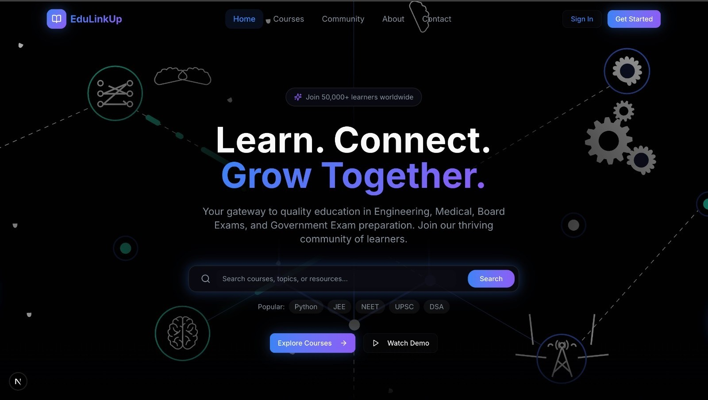

  <div align="center">
    
  </div>

<div align="center"></div>

# <div align="center">YourCapstone</div>

  <div align="center">
    
  </div>

## 🎓 Your Trusted Academic Project Partner

**YourCapstone** is a professional project development service designed specifically for students who need high-quality academic projects, final year capstone projects, and assignments delivered on time with complete documentation. Built with cutting-edge web technologies, it provides an immersive learning experience with a glassmorphic UI, dark mode support, and comprehensive course management. It offers 24/7 access to courses, interactive community discussions, personalised learning paths, and AI-powered features to enhance the educational journey.

---

### Vision: Empowering Students Through Quality Project Development

Academic excellence requires not just knowledge but also the ability to deliver quality projects that meet stringent requirements. Students across India face challenges in completing their final year projects, capstone assignments, and technical work due to time constraints, technical complexity, or lack of resources.

The vision for YourCapstone is to provide a reliable, professional service that delivers custom-made academic projects with complete source code, documentation, and support. We help students succeed in their academic journey by handling the technical implementation while they focus on understanding and presenting their work. We believe that every student deserves access to world-class educational resources, expert guidance, and a supportive community—regardless of their geographic location or economic background. EduLinkUp is more than just a learning platform; it is a holistic educational ecosystem designed to transform the way students learn, collaborate, and succeed.

#### The YourCapstone Difference

* **Comprehensive Project Services**: From web development and mobile apps to ML/AI and database projects, YourCapstone covers all types of academic project requirements. Students can access courses tailored to JEE, NEET, UPSC, SSC, Banking exams, and CBSE/State Board curricula—all in one place. This eliminates the need to juggle multiple platforms and provides a unified learning experience.

* **Interactive Community-Driven Learning**: Learning is not just about consuming content; it's about engaging with peers, asking questions, and sharing knowledge. Our community forum creates a vibrant space where students can discuss complex topics, share study strategies, and support each other's learning journeys. The rich text editor with code syntax highlighting makes it perfect for technical discussions, while the reputation system encourages quality contributions.

* **Modern, Engaging User Experience**: We understand that today's students are digital natives who expect intuitive, visually appealing interfaces. EduLinkUp features a stunning glassmorphic design with neon accents, smooth Lottie animations, and dynamic visual elements that make learning enjoyable. The dark-mode-first approach reduces eye strain during long study sessions, while the responsive design ensures seamless access across all devices.

* **Personalized Learning Paths**: Every student learns differently and at their own pace. EduLinkUp's advanced filtering and search capabilities help students find exactly what they need, while progress tracking and learning analytics provide insights into their journey. Course difficulty levels (Beginner/Intermediate/Advanced) ensure that content matches each student's current capabilities.

* **Building a Supportive Ecosystem**: Beyond courses and content, EduLinkUp fosters a complete educational ecosystem with FAQ sections, contact support, comprehensive privacy policies, and terms of service. We're committed to creating a safe, trustworthy environment where students can focus on what matters most—learning and growing.

In essence, EduLinkUp aims to bridge the gap between traditional education and modern learning needs, making quality education accessible, engaging, and effective for every Indian student. By integrating cutting-edge technology with proven pedagogical approaches, EduLinkUp seeks to become the trusted companion for students on their journey toward academic excellence and career success.

## Live Demo

Experience YourCapstone live here: 
👉 [](https://your-capstone.vercel.app/)

 <div align="center">
 <p>

[](https://github.com/ellerbrock/open-source-badges/)


 </p>
 </div>

<div align="center">
  
  <br>
</div>

## ✨ Features 
<div align="center">
  
</div>

### 🎯 Core Features

#### 1. 📚 **Comprehensive Course Management**
- **Multi-Category Support**: Engineering, Medical, Government Exams, Board Exams (CBSE/State Boards)
- **Detailed Course Pages**: Each course includes complete information with instructor details, ratings, duration, and lesson counts
- **Video-Based Learning**: Integrated YouTube video player for seamless video lessons
- **Playlist Management**: Organized course content with interactive playlist sidebar for easy navigation
- **Lesson Notes & Resources**: Downloadable study materials and lesson-specific notes
- **Progress Tracking**: Track your learning progress across courses
- **Advanced Search & Filters**: Find courses by category, level (Beginner/Intermediate/Advanced), instructor, or keywords
- **Multiple View Modes**: Switch between grid and list views for course browsing

#### 2. 💬 **Interactive Community Forum**
- **Discussion Platform**: Students can create posts, ask questions, and share knowledge
- **Rich Text Editor**: Advanced WYSIWYG editor powered by TipTap with support for:
  - Text formatting (Bold, Italic, Headers)
  - Code blocks with syntax highlighting
  - Lists (Ordered/Unordered)
  - Links and images
  - Quotes and more
- **Thread Management**: Organized discussion threads with nested replies
- **Engagement Features**: Likes, views, and reply counts
- **User Reputation System**: Gamified reputation points for active contributors
- **Hot & Trending Posts**: Algorithm to surface popular discussions
- **Pinned Posts**: Important announcements and resources stay visible
- **Category & Tag System**: Organize discussions by subject, exam type, and topics
- **Edit History**: Track changes made to posts with version history
- **Related Discussions**: Smart recommendations for similar topics

#### 3. 🔐 **User Authentication & Authorization**
- **Secure Sign-Up/Login**: Email and password-based authentication
- **Password Recovery**: Forgot password functionality with email reset
- **Auth Callback Handling**: Robust OAuth callback management
- **Protected Routes**: Secure access to premium content and user-specific features
- **Profile Management**: User profile with learning history and achievements

#### 4. 🎨 **Modern UI/UX Design**

##### Stand-Out Design Elements:
- **Glassmorphic Interface**: Modern frosted-glass effect UI components
- **Neon Accents**: Eye-catching neon purple and blue accent colors
- **Lottie Animations**: Smooth, engaging animations on the hero section
- **Floating Orb Backgrounds**: Dynamic animated background elements
- **Grid Pattern Overlays**: Subtle geometric patterns for depth
- **Dark Mode First**: Optimized for dark theme with seamless light mode support
- **Responsive Design**: Fully responsive across desktop, tablet, and mobile devices
- **Custom Skeleton Loaders**: Smooth loading states for better UX
- **Animated Components**: Micro-interactions and transitions throughout

#### 5. 📊 **Educational Resources**
- **Category Sections**: Browse courses by Engineering, Medical, Government Exams, and Boards
- **Featured Courses**: Highlighted top-rated and popular courses
- **Stats Dashboard**: Display platform statistics (students, courses, completion rates)
- **Learning Analytics**: Track your learning progress and achievements

#### 6. 📄 **Information Pages**
- **About Us**: Platform mission and vision
- **Contact**: Get in touch with support
- **FAQ**: Frequently asked questions with accordion interface
- **Privacy Policy**: Comprehensive privacy information
- **Terms of Service**: Legal terms and conditions

---

## 🎨 Stand-Out Features
<div align="center">
  
</div>

### 🌟 1. **Premium Glassmorphic Design**
EduLinkUp features a stunning glassmorphic (frosted glass) UI that sets it apart from traditional educational platforms. The design includes:
- Translucent cards with backdrop blur effects
- Neon-colored borders and highlights (Neon Purple `#a855f7` and Neon Blue `#3b82f6`)
- Animated floating background elements
- Sophisticated gradient overlays

### 🚀 2. **Lottie Animation Integration**
The hero section features smooth, professional Lottie animations that create an engaging first impression without compromising performance.

### ✍️ 3. **Advanced Rich Text Editor**
The community forum includes a powerful rich text editor with:
- Real-time character counting
- Syntax-highlighted code blocks (via Lowlight)
- Inline link and image insertion
- Keyboard shortcuts for power users
- Markdown-style editing

### 🎯 4. **Intelligent Course Filtering**
Advanced filtering system with:
- Real-time search across course titles and descriptions
- Multi-level category filtering
- Sort by popularity, rating, or newest
- "Coming Soon" indicators for future content

### 🏆 5. **Gamification Elements**
- User reputation system in community
- Course completion badges
- Learning streak tracking
- Hot/trending content algorithms

### 📱 6. **Mobile-First Responsive Design**
- Custom mobile navigation with sheet drawer
- Touch-optimized interactions
- Adaptive layouts for all screen sizes
- Mobile-specific optimizations

### 🔍 7. **SEO & Performance Optimized**
- Built with Next.js 16 for optimal performance
- Server-side rendering capabilities
- Image optimization
- Analytics integration with Vercel Analytics

---

## 🛠️ Technologies Used


### **Frontend Framework**
- **[Next.js 16](https://nextjs.org/)** - React framework with App Router
- **[React 19.2](https://react.dev/)** - UI library
- **[TypeScript 5.9](https://www.typescriptlang.org/)** - Type-safe development

### **Styling & UI**
- **[Tailwind CSS 4.1](https://tailwindcss.com/)** - Utility-first CSS framework
- **[Radix UI](https://www.radix-ui.com/)** - Unstyled, accessible UI components
  - Accordion, Alert Dialog, Avatar, Checkbox, Dialog, Dropdown Menu, and 20+ more components
- **[shadcn/ui](https://ui.shadcn.com/)** - Re-usable component system
- **[next-themes](https://github.com/pacocoursey/next-themes)** - Dark mode support
- **[Lucide React](https://lucide.dev/)** - Beautiful icon library (450+ icons)
- **[tailwindcss-animate](https://github.com/jamiebuilds/tailwindcss-animate)** - CSS animation utilities
- **[class-variance-authority](https://cva.style/)** - Component variant management
- **[clsx](https://github.com/lukeed/clsx) + [tailwind-merge](https://github.com/dcastil/tailwind-merge)** - Conditional className utilities

### **Rich Content & Interactivity**
- **[TipTap](https://tiptap.dev/)** - Headless WYSIWYG editor framework
  - Starter Kit for basic editing
  - Code Block with Lowlight for syntax highlighting
  - Image and Link extensions
  - Placeholder extension
- **[Lowlight](https://github.com/wooorm/lowlight)** - Syntax highlighting for code blocks
- **[Lottie React](https://github.com/Gamote/lottie-react)** - Airbnb's Lottie animations
- **[Marked](https://marked.js.org/)** - Markdown parser and compiler

### **Form Management**
- **[React Hook Form](https://react-hook-form.com/)** - Performant form validation
- **[Zod](https://zod.dev/)** - TypeScript-first schema validation
- **[@hookform/resolvers](https://github.com/react-hook-form/resolvers)** - Form validation resolvers

### **UI Components & Utilities**
- **[Embla Carousel](https://www.embla-carousel.com/)** - Lightweight carousel library
- **[Recharts](https://recharts.org/)** - Composable charting library
- **[React Day Picker](https://daypicker.dev/)** - Date picker component
- **[Sonner](https://sonner.emilkowal.ski/)** - Toast notifications
- **[cmdk](https://cmdk.paco.me/)** - Command palette/menu
- **[Vaul](https://vaul.emilkowal.ski/)** - Drawer component for mobile
- **[input-otp](https://input-otp.rodz.dev/)** - OTP input component
- **[date-fns](https://date-fns.org/)** - Modern date utility library
- **[react-resizable-panels](https://github.com/bvaughn/react-resizable-panels)** - Resizable panel layouts

### **Analytics & Monitoring**
- **[Vercel Analytics](https://vercel.com/analytics)** - Web analytics and insights

### **Development Tools**
- **[Autoprefixer](https://github.com/postcss/autoprefixer)** - CSS vendor prefixing
- **[PostCSS](https://postcss.org/)** - CSS transformation tool
- **ESLint** - Code linting and quality

## 📺 Video Explanation

For a detailed walkthrough of EduLinkUp's features and how to use them, check out this video:

**[Video Coming Soon]**

---

## 📁 Project Structure

<details>
<summary><strong>🗂️ Click to view detailed project architecture</strong></summary>

```bash
EduLinkUp/
├── app/                          # Next.js App Router pages
│   ├── layout.tsx                # Root layout with providers
│   ├── page.tsx                  # Home page
│   ├── globals.css               # Global styles
│   ├── about/                    # About page
│   ├── auth/                     # Authentication routes
│   │   ├── callback/             # OAuth callback handler
│   │   ├── confirm/              # Email confirmation
│   │   └── auth-code-error/      # Error handling
│   ├── community/                # Community forum
│   │   ├── page.tsx              # Forum listing
│   │   ├── [id]/                 # Individual discussion thread
│   │   └── loading.tsx           # Loading state
│   ├── courses/                  # Course pages
│   │   ├── page.tsx              # Course catalog
│   │   ├── [id]/                 # Individual course
│   │   │   ├── page.tsx          # Course detail view
│   │   │   └── data/             # Course-specific data
│   │   │       └── lesson-notes.ts # Lesson notes and resources
│   │   ├── coming-soon/          # Coming soon placeholder
│   │   └── loading.tsx           # Loading state
│   ├── contact/                  # Contact page
│   ├── faq/                      # FAQ page
│   ├── login/                    # Login page
│   ├── signup/                   # Registration page
│   ├── forgot-password/          # Password recovery
│   ├── reset-password/           # Password reset
│   ├── privacy/                  # Privacy policy
│   └── terms/                    # Terms of service
│
├── components/                   # React components
│   ├── navbar.tsx                # Navigation bar
│   ├── footer.tsx                # Footer
│   ├── auth-provider.tsx         # Authentication context
│   ├── theme-provider.tsx        # Theme management
│   ├── home/                     # Home page components
│   │   ├── hero-section.tsx      # Landing hero with Lottie
│   │   ├── category-section.tsx  # Course categories
│   │   ├── featured-courses.tsx  # Featured content
│   │   ├── community-section.tsx # Community preview
│   │   └── stats-section.tsx     # Platform statistics
│   ├── courses/                  # Course components
│   │   ├── course-card.tsx       # Course preview card
│   │   ├── course-content.tsx    # Course player
│   │   ├── video-player.tsx      # YouTube embed
│   │   ├── playlist-sidebar.tsx  # Lesson navigation
│   │   └── category-filter.tsx   # Filter controls
│   ├── community/                # Forum components
│   │   ├── discussion-card.tsx   # Discussion preview
│   │   ├── answer-thread.tsx     # Reply thread
│   │   ├── rich-text-editor.tsx  # TipTap editor
│   │   ├── community-sidebar.tsx # Forum sidebar
│   │   ├── create-post-dialog.tsx # New post modal
│   │   ├── edit-history-modal.tsx # Version history
│   │   └── related-discussions.tsx # Recommendations
│   └── ui/                       # 60+ Reusable UI components
│       ├── accordion.tsx
│       ├── alert-dialog.tsx
│       ├── alert.tsx
│       ├── aspect-ratio.tsx
│       ├── avatar.tsx
│       ├── badge.tsx
│       ├── button.tsx
│       ├── card.tsx
│       ├── dialog.tsx
│       ├── input.tsx
│       ├── select.tsx
│       ├── tabs.tsx
│       └── ... (shadcn/ui components)
│
├── lib/                          # Utility functions
│   ├── auth.ts                   # Authentication helpers (mock)
│   └── utils.ts                  # General utilities (cn, etc.)
│
├── hooks/                        # Custom React hooks
│   ├── use-mobile.ts             # Mobile detection hook
│   └── use-toast.ts              # Toast notification hook
│
├── public/                       # Static assets
│   └── hero-animation.json       # Lottie animation data
│
├── styles/                       # Additional styles
│   └── globals.css               # Extended global styles
│
├── components.json               # shadcn/ui configuration
├── next.config.mjs               # Next.js configuration
├── tsconfig.json                 # TypeScript configuration
├── postcss.config.mjs            # PostCSS configuration
├── package.json                  # 🔷 Dependencies and scripts
└── README.md                     # Project documentation
```

</details>

---

## ⚙️ Installation and Setup

> Clone and run locally using Node.js, npm/yarn/pnpm, and Next.js.

### Prerequisites
- **Node.js 18+** (Download from [nodejs.org](https://nodejs.org/))
- **npm**, **yarn**, or **pnpm** package manager
- **Git** (for version control)

### Installation Steps

1. **Clone the repository:**

   ```bash
   git clone https://github.com/Developers-Capstone/EduLinkUp.git
   cd EduLinkUp
   ```

2. **Install dependencies:**

   ```bash
   npm install
   # or
   yarn install
   # or
   pnpm install
   ```

3. **Run the development server:**

   ```bash
   npm run dev
   # or
   yarn dev
   # or
   pnpm dev
   ```

4. **Open your browser:**
   Navigate to [http://localhost:3000](http://localhost:3000)

### Build for Production

```bash
npm run build
npm start
```

### Linting

```bash
npm run lint
```

---

## 🎯 Target Audience

EduLinkUp is designed for:
- **JEE/NEET Aspirants**: Engineering and medical entrance exam preparation
- **UPSC/Government Exam Candidates**: Civil services and competitive exam preparation
- **Board Exam Students**: CBSE and State Board students (Classes 9-12)
- **Skill Learners**: Students learning programming, data structures, and other technical skills
- **Educators**: Teachers and instructors creating and sharing educational content

---

## 🎨 Design Philosophy

### Color Scheme
- **Primary**: Neon Purple (`#a855f7`) - For primary actions and highlights
- **Secondary**: Neon Blue (`#3b82f6`) - For secondary elements and accents
- **Background**: Dark with glassmorphic overlays
- **Text**: High contrast for optimal readability

### Typography
Modern, clean fonts optimized for readability in educational content.

### Accessibility
- WCAG 2.1 compliant color contrasts
- Keyboard navigation support
- Screen reader friendly
- Focus indicators on interactive elements

---

## 📦 Key Dependencies Overview

| Package | Purpose | Version |
|---------|---------|---------|
| Next.js | React Framework | 16.0.3 |
| React | UI Library | 19.2.0 |
| TypeScript | Type Safety | 5.9.3 |
| Tailwind CSS | Styling | 4.1.9 |
| TipTap | Rich Text Editor | 3.11.1 |
| Radix UI | UI Primitives | Various |
| Zod | Validation | 3.25.76 |
| Lucide React | Icons | 0.454.0 |
| React Hook Form | Form Management | 7.60.0 |

---

## 🔒 Security Features

- **Environment Variables**: Sensitive data stored securely
- **Input Validation**: Zod schemas for all user inputs
- **XSS Protection**: Sanitized user-generated content
- **CSRF Protection**: Built-in Next.js security features
- **Secure Authentication**: Password hashing and secure token management (mock implementation)

---

## 🌐 Browser Support

- Chrome/Edge (latest 2 versions)
- Firefox (latest 2 versions)
- Safari (latest 2 versions)
- Mobile browsers (iOS Safari, Chrome Android)

---

## 📈 Performance Optimizations

- **Image Optimization**: Next.js automatic image optimization
- **Code Splitting**: Automatic route-based code splitting
- **Lazy Loading**: Components loaded on demand
- **Bundle Size**: Optimized with tree-shaking
- **Caching**: Aggressive caching strategies
- **CDN**: Static assets served via CDN (Vercel)

---

## Issue Creation ✴
Report bugs and  issues or propose improvements through our GitHub repository.

## Contribution Guidelines 📑

<div align="center">
  
</div>

- Firstly Star(⭐) the Repository
- Fork the Repository and create a new branch for any updates/changes/issue you are working on.
- Start Coding and do changes.
- Commit your changes
- Create a Pull Request which will be reviewed and suggestions would be added to improve it.
- Add Screenshots and updated website links to help us understand what changes is all about.

- Check the [CONTRIBUTING.md](CONTRIBUTING.md) for detailed steps...
    
## Contributing is fun🧡

We welcome all contributions and suggestions!
Whether it's a new feature, design improvement, or a bug fix — your voice matters 💜

Your insights are invaluable to us. Reach out to us team for any inquiries, feedback, or concerns.

## 👥 Contributors

Thanks to these wonderful people for contributing 💖

[](https://github.com/developers-capstone/EduLinkUp/graphs/contributors)

<p>
  <!-- Vaunt.dev (auto-updating SVG contributors graph) -->
  <a href="https://github.com/developers-capstone/EduLinkUp/graphs/contributors">
    
  </a>
</p>

## 📄 License

This project is open-source and available under the [MIT License](LICENSE).

## 📞 Contact

Developed by [Eccentric Explorer](https://developers-capstone.github.io/Me)

Feel free to reach out with any questions or feedback\! Thanks for reading, here's a cookiepookie:


